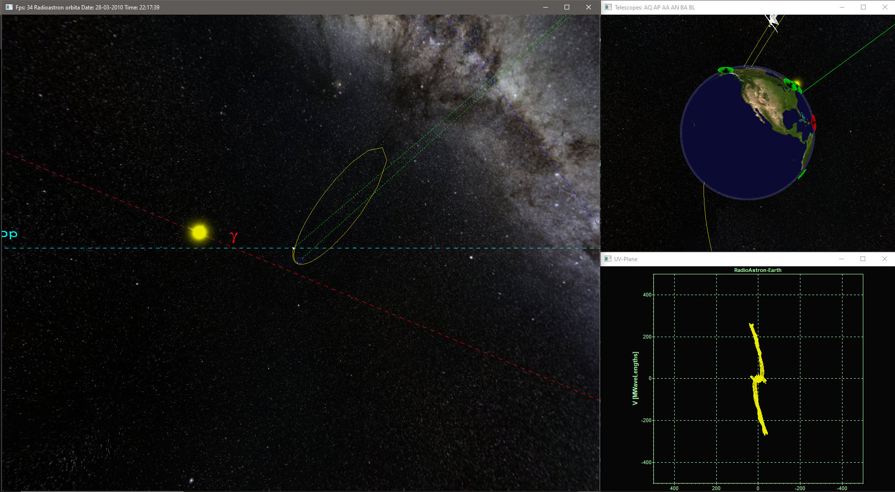

# 2009_WIN32_3D_OpenGL_Space_VLBI_visualization
Visualization of VLBI observations and space radiotelescope orbit evolution in Radioastron mission, Win32, OpenGL

The program is written for the Windows platform (32 bits, WinXP and older) in C++. To work with windows and system calls, the Win32 API is used, 3D graphics are implemented through OpenGL.

* Read in other languages: [English](README.md), [Russian](README.ru.md)

Screenshot:

# Table of contents
- [Installation](#Installation)
- [Short description](#Short-description)

# Installation

To use it, just download the VLBI.zip file, unpack the archive and run Visualization.exe, modern windows versions are supported.

To compile from source (code folder), you must use the C++ compiler from Visual Studio.

# Short description

The program visualizes the evolution of the orbit of the RadioAstron space radio telescope, as well as the possibilities of observation using the very long baseline radio interferometry (VLBI) method. The space radio telescope was launched at an elongated highly elliptical orbit around the Earth with an apogee of about 350,000 km. Under the influence of the gravitational perturbation from the Moon, the plane of the orbit evolved over time, which made it possible to observe more astronomical sources. During VLBI observations, several telescopes (both space and ground) simultaneously observe the same astronomical source, then the data obtained on the telescopes are processed jointly, which allows you to create a "virtual" telescope with an aperture (and angular resolution) determined by the maximum distance between telescopes. The VLBI method makes it possible to achieve an angular resolution greater than any other method used astronomy today (up to a few arc microseconds). However, this method has a significant lack. During VLBI observations, it is not the distribution of brightness over an astronomical source (image) that is measured, but a certain spectrum of spatial frequencies from this distribution of brightness (image). The more different spatial frequencies (UV-plane) are measured in the observations, the better the quality of the final image will be. This program demonstrates UV-plane filling (bottom right window in the screenshot) obtained in a given time (usually on the order of several hours or days) for a certain astronomical source in a certain part of the orbit of the space radio telescope (the plane of the orbit evolves in time). The left window shows the observation geometry - the orbit, the direction to the source, the top right window shows ground-based telescopes. The visibility of the source with ground-based telescopes is shown in color. Green color - the telescope currently sees the source, red - does not see it. Observation parameters are set in a separate dialog.
